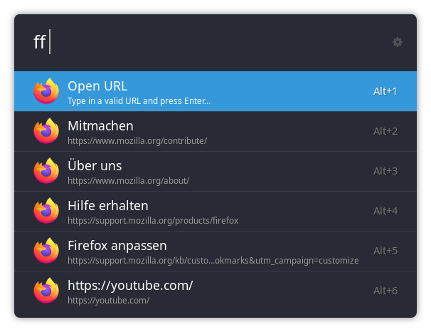

# Ulauncher Firefox

Simple [Ulauncher](https://ulauncher.io) extension for opening websites in Firefox. The extensions provides suggestions
based on the browsing history as well as the bookmarks.

## Settings

In Ulauncher GUI, you can set the extension's preferences. Here, the **maximal number** of suggested items and the
respective **sorting criteria** can be changed. The order of suggestions can be determined by  

- last visit date
- visit count
- Firefox frecency (see [here](https://developer.mozilla.org/en-US/docs/Mozilla/Tech/Places/Frecency_algorithm) for
  more info)

## Usage

Open Ulauncher and type in the set up keyword (defaults to `ff`). You can then either provide a valid URL to open a
webpage, or a search query to browse your browser's history and bookmarks.

To open the selected URL, press Enter. You can also copy the URL to your input by pressing ALT + ENTER.

## License

This project is licensed under the terms of the GPLv3 license. See the LICENSE file for details.
